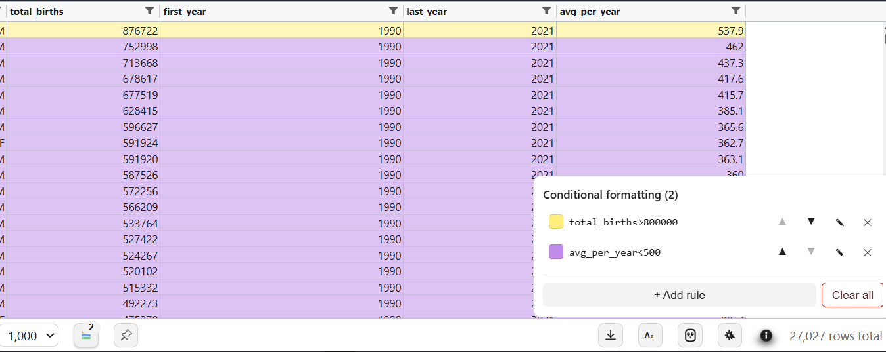
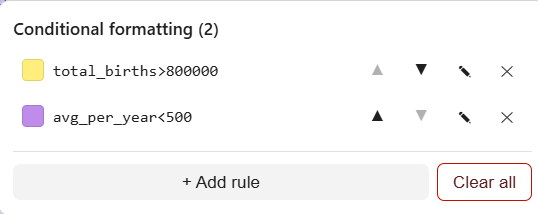
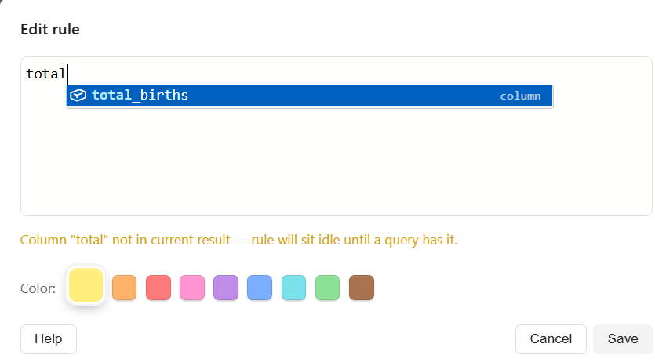

# Conditional formatting — user manual

Conditional formatting lets you **color rows automatically** based on their values —
the same idea as conditional formatting in Excel or Google Sheets, but running live on
your query results inside VS Code. Write a rule like `revenue > 100000`, pick a color,
and every matching row lights up. No export round-trip.

This manual is the how-to walkthrough. For the complete list of functions, operators,
and syntax, see the [Formula language reference](formula-language.md).

---

## Contents

1. [The idea in 30 seconds](#the-idea-in-30-seconds)
2. [Opening the rules panel](#opening-the-rules-panel)
3. [Adding your first rule](#adding-your-first-rule)
4. [The formula editor](#the-formula-editor)
5. [Ordering rules — first match wins](#ordering-rules--first-match-wins)
6. [Editing, reordering, and deleting](#editing-reordering-and-deleting)
7. [Worked examples](#worked-examples)
8. [Rules vs. manual row coloring](#rules-vs-manual-row-coloring)
9. [When a rule stops matching](#when-a-rule-stops-matching)
10. [Where rules are saved](#where-rules-are-saved)

---

## The idea in 30 seconds

- A **rule** is one formula plus one color.
- The formula is evaluated **once per row**. If it returns true, that row is painted in
  the rule's color.
- You can stack **multiple rules**. They are checked **top to bottom** and the **first
  one that matches wins** — so a row is only ever painted by a single rule.
- Rules **only color rows — they never hide them**. (To hide rows, use
  [column filters](../README.md#column-filters).)



---

## Opening the rules panel

Run a query so you have a result in the **Results** panel, then click the
**paint-drop button** in the footer toolbar. A small **badge** on the button shows how
many rules are currently defined for this file.



The rules **popover** opens, listing every rule for the current `.sql` file with its
color swatch, a short preview of its formula, and per-rule controls.


---

## Adding your first rule

1. Click **Add rule** in the popover to open the rule editor modal.
2. **Pick a color** from the 9-color palette (yellow, orange, red, pink, purple, blue,
   cyan, green, brown).
3. **Type a formula** in the editor — e.g. `total > 1000000`.
4. Watch the **live preview** underneath: it reports **"Matches N of M rows"** as you
   type, so you know the rule does something before you save it.
5. Click **Save**. The popover updates and the grid repaints instantly.


> **Tip:** The modal is draggable — grab its title bar and move it aside if it covers the
> rows you want to watch light up.

---

## The formula editor

The formula box is a real **Monaco editor** (the same engine that powers VS Code), so it
behaves like writing code, not filling in a text box:

- **Autocomplete** — start typing and press `Ctrl+Space`, or type `(` after a function
  name. You get **your result's actual column names** plus every built-in function.
  Column names with spaces are auto-quoted in backticks for you.
- **Snippets** — accepting a function like `COUNTIF` drops in
  `COUNTIF(column_ref, criterion)` with tab-stops you can `Tab` through.
- **Hover** — hover a function name to see its signature, description, and an example.
- **Signature help** — as you type arguments, the current parameter is highlighted.
- **Inline errors** — a red squiggle marks syntax errors; a subtle info hint appears if
  you quote a string that exactly matches a column name (a nudge to use backticks).



The formula language is Sheets/Excel-shaped: `IF`, `AND`/`OR`/`NOT`, `CONTAINS`, `LEN`,
`LOWER`/`UPPER`, `YEAR`/`MONTH`/`DAY`/`TODAY`/`DATE`, `ISNULL`/`ISBLANK`, `MOD`/`ABS`/`ROUND`,
and cross-row `COUNTIF`/`COUNTIFS`, with operators `= <> < <= > >= + - * /`. See the
[Formula language reference](formula-language.md) for the full surface area.

---

## Ordering rules — first match wins

When you have more than one rule, order matters. Each row is checked against the rules
**from top to bottom**, and the **first rule that matches** paints the row — later rules
don't get a look at that row.

A common pattern is **most-specific-first**:

```
1. revenue > 1000000          → green   (star performers)
2. revenue > 500000           → blue    (strong)
3. revenue < 0                → red      (losses)
```

If rule 2 were above rule 1, every big number would stop at "strong" (blue) and nothing
would ever turn green. Put the tightest thresholds on top.

---

## Editing, reordering, and deleting

From the rules popover:

- **✎ Edit** (or **double-click the rule row**) — reopens the modal to change the color
  or formula.
- **▲ / ▼** — move a rule up or down to change its priority.
- **✕ Delete** — remove a single rule.
- **Clear all** — wipe every rule for this file. There's no extra confirmation dialog —
  opening the popover is the first "click" and **Clear all** is the second, which is the
  guard against an accidental wipe.

---

## Worked examples

Paste any of these into the formula editor and adapt the column names to your result.

**Flag high-value rows**
```
total > 1000000
```

**Highlight this year's records**
```
YEAR(order_date) = 2026
```

**Catch missing data**
```
ISNULL(customer_name)
```

**Range (there is no BETWEEN)**
```
AND(score >= 60, score <= 300)
```

**Case-insensitive text match**
```
CONTAINS(LOWER(status), "cancel")
```

**Zebra stripes on a numeric key**
```
MOD(row_id, 2) = 0
```

**Duplicates — values that appear more than 30 times (cross-row)**
```
COUNTIF(name, name) > 30
```

---

## Rules vs. manual row coloring

Conditional formatting (automatic) and **manual row painting** (click/drag a color from
the footer color picker) coexist cleanly:

- On a row that **a rule matches**, a manual click paints only the small **row-number
  gutter** square — so your hand-picked mark and the rule color are both visible.
- On a row that **no rule matches**, a manual click paints the **whole row** as usual.

See [Row highlighting](../README.md#row-highlighting) in the README for the manual
color picker and drag-to-paint behavior.

---

## When a rule stops matching

Rules are **non-blocking** — a rule that can't apply sits quietly rather than breaking the
grid:

- **Missing column** — if a rule references a column that isn't in the current result
  (you ran a different query), it sits idle with a **⚠** in the rules list. Run a query
  that has the column again and it resumes matching — no edit needed.
- **Type mismatch** — comparing a text column to a number (because the column's type
  changed between queries) skips those rows silently instead of failing.
- **Broken formula at runtime** — if a rule ever throws while evaluating, it's retired
  after one failure with a ⚠ "could not be evaluated" marker, and the grid still paints
  everything else. Fix the formula and re-save.

---

## Where rules are saved

- Rules are stored **per `.sql` file**, in VS Code's `workspaceState`.
- They **survive restarts**, **follow file renames**, and are **copied to duplicates** of
  a file (matched by content hash).
- **Closing** a file's tab keeps its rules; **deleting** the file removes them.
- In a **multi-statement script**, rules apply **per statement** — each statement has its
  own column set, so a rule can match one statement and sit idle on another.

---

*Full function and operator reference:* **[formula-language.md](formula-language.md)**
